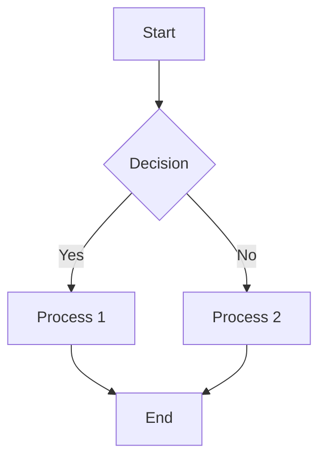

# Mermaid Diagram Generator

## Overview

Generate Mermaid diagram code from natural language descriptions and validate syntax before outputting. Mermaid is a JavaScript-based diagramming tool that renders diagrams from text definitions.

## When to Use

- User says "create a flowchart", "draw a diagram", "make a mind map"
- User wants "sequence diagram", "class diagram", "ER diagram", "state diagram"
- User mentions "Mermaid" directly
- User wants to visualize processes, architectures, or relationships
- User needs syntax-validated diagram code

## Supported Diagram Types

| Type | Keyword triggers |
|------|------------------|
| Flowchart | flowchart, flow chart, 流程图 |
| Sequence Diagram | sequence, 时序图, 顺序图 |
| Class Diagram | class diagram, 类图 |
| State Diagram | state diagram, 状态图 |
| ER Diagram | ER diagram, er图, 实体关系图 |
| Gantt Chart | gantt, 甘特图 |
| Pie Chart | pie chart, 饼图 |
| Mind Map | mind map, 思维导图 |
| Journey | user journey, 用户旅程 |
| Git Graph | git graph, git graph |

## Core Pattern

### Step 1: Identify Diagram Type

Match user intent to the most appropriate Mermaid diagram type:
- Process flows → Flowchart
- Time-based interactions → Sequence Diagram
- Object relationships → Class Diagram
- State transitions → State Diagram
- Database schema → ER Diagram
- Timeline scheduling → Gantt Chart
- Proportional data → Pie Chart
- Hierarchical information → Mind Map

### Step 2: Generate Mermaid Syntax



### Step 3: Validate Syntax (REQUIRED)

**Always validate before outputting:**

1. **Check bracket matching**: All `[`, `]`, `(`, `)`, `{`, `}` must be balanced
2. **Verify direction**: `TD`, `BT`, `LR`, `RL` for graphs; `<<` for sequence actors
3. **Validate arrow syntax**: `-->` or `---` for links, `-->|text|` for labeled links
4. **Check node IDs**: Unique identifiers without special characters
5. **Test with Mermaid Live Editor**: https://mermaid.live/

**Common syntax errors to avoid:**
- Missing direction (`graph` without TD/BT/LR/RL)
- Unclosed brackets in node labels
- Invalid arrow types (use `-->` not `->`)
- Duplicate node IDs
- Missing colon after graph type (`graph TD` not `graph`)

### Step 4: Provide Output

Present the validated Mermaid code in a markdown code block with `mermaid` language tag.

## Quick Reference

### Flowchart Syntax

```
graph TD/BT/LR/RL
    Node[DisplayID Text]
    NodeID --> OtherNode
    NodeID -->|Label| OtherNode
    NodeID --> Decision{condition}
```

### Sequence Diagram Syntax

```
sequenceDiagram
    participant A as Actor
    participant B as System
    A->>B: Request
    B-->>A: Response
    Note over A,B: Note text
```

### Class Diagram Syntax

```
classDiagram
    Class01 <|-- DerivedClass
    Class01 : +method1()
    Class01 : +method2()
    Class01 *-- Class02
```

### State Diagram Syntax

```
stateDiagram-v2
    [*] --> State1
    State1 --> State2
    State2 --> [*]
```

### ER Diagram Syntax

```
erDiagram
    CUSTOMER ||--o{ ORDER : places
    ORDER ||--|{ LINE-ITEM : contains
```

## Validation Checklist

Before presenting any Mermaid code, verify:

- [ ] All brackets and braces are balanced
- [ ] Graph direction is specified (TD/BT/LR/RL)
- [ ] Node IDs use only alphanumeric and underscore
- [ ] Arrow directions are correct (-->, --, |-)
- [ ] Labels use pipe characters (|label|)
- [ ] No duplicate node IDs in same diagram
- [ ] Special characters in labels are escaped

## Common Mistakes

| Mistake | Fix |
|---------|-----|
| Missing graph direction | Add TD/BT/LR/RL after `graph` |
| Unclosed brackets | Close all `[`, `(`, `{` |
| Wrong arrow type | Use `-->` for solid, `--` for line |
| Missing pipe in labels | Use `-->|label|` not `-->label` |
| Duplicate IDs | Use unique IDs: A1, A2 not A, A |

## Integration with Excalidraw

For complex diagrams requiring manual editing:
- Use Excalidraw for interactive diagrams
- Export Excalidraw to Mermaid when possible
- Consider user's preference for tool

## Resources

- Mermaid Live Editor: https://mermaid.live/
- Mermaid Documentation: https://mermaid.js.org/intro/
- Mermaid GitHub: https://github.com/mermaid-js/mermaid
